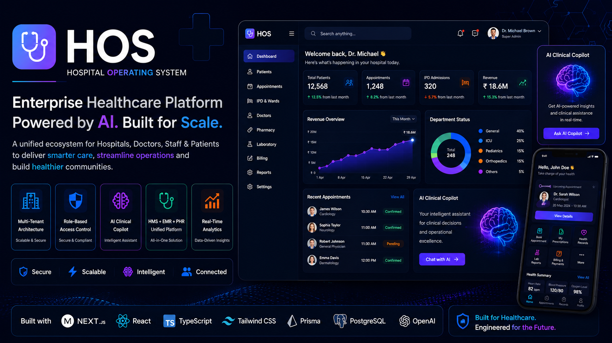
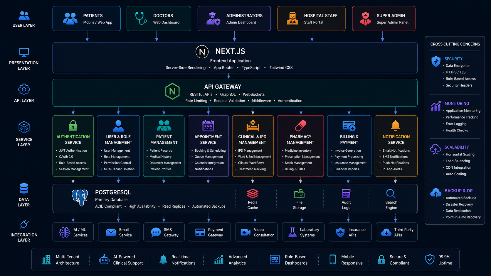
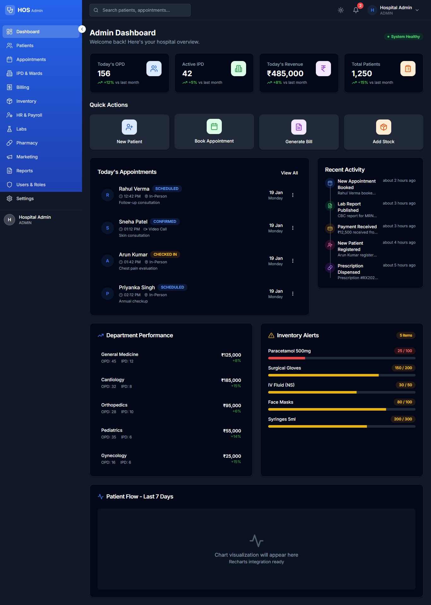
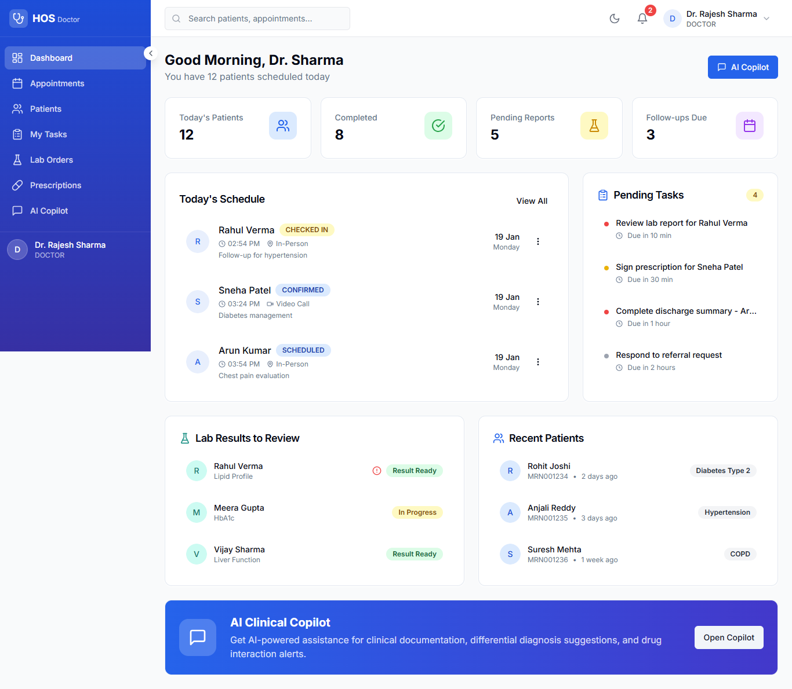
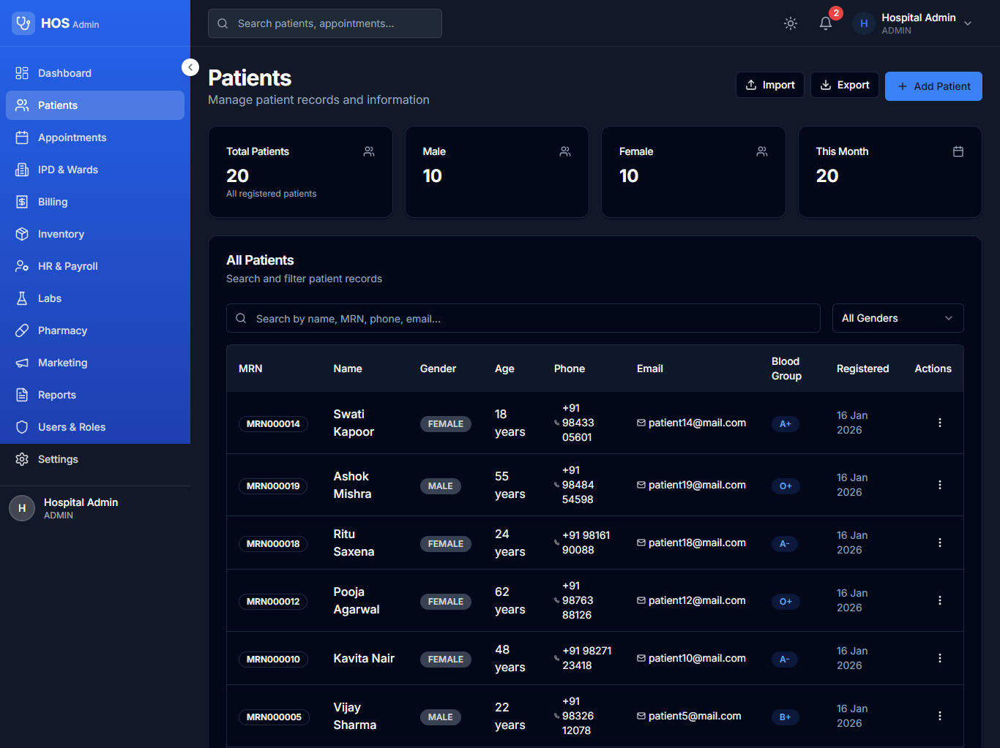
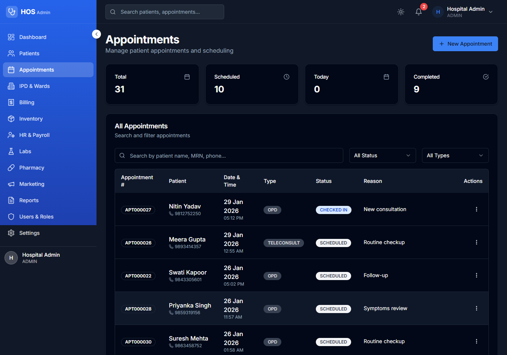
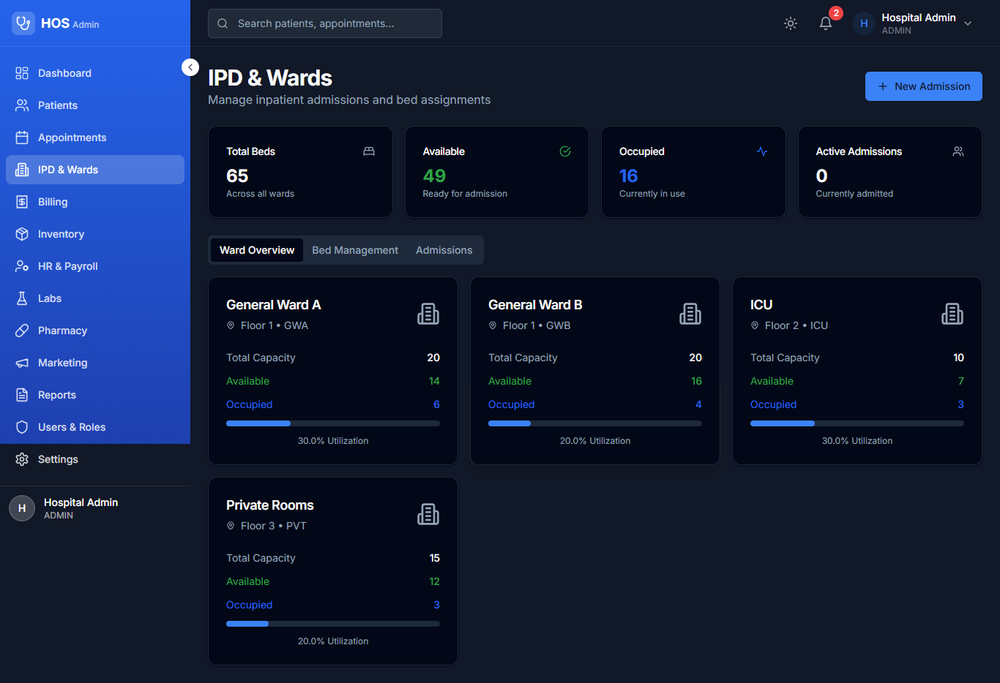
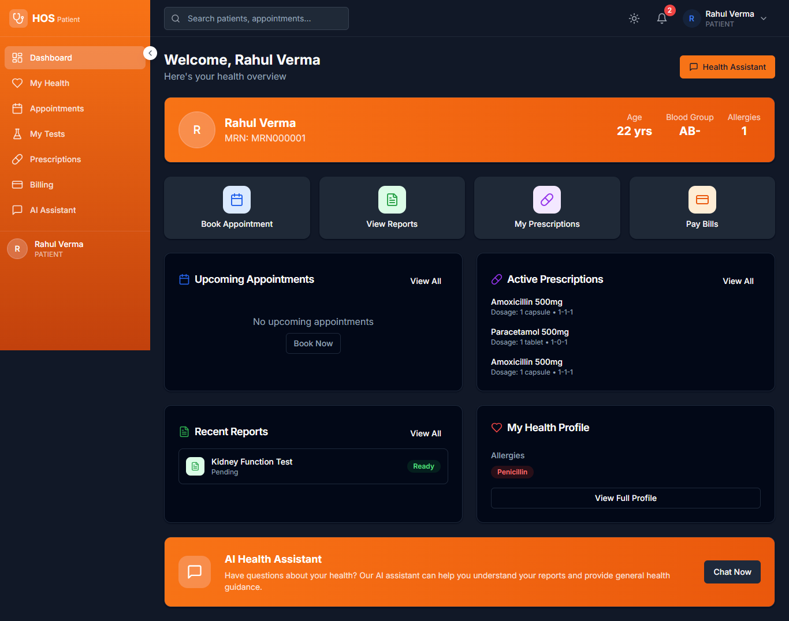

# 🏥 HOS — Hospital Operating System


Enterprise-grade multi-tenant Hospital Operating System integrating HMS, EMR, PHR, AI-assisted healthcare workflows, and scalable healthcare infrastructure into one unified digital healthcare platform.

---

<p align="center">
  
</p>

---

## 🌐 Live Platform

🌐 [Live Platform](https://hos.shivamitcs.in)

---

## Platform Vision

HOS (Hospital Operating System) is a modern enterprise healthcare ecosystem engineered for hospitals, clinics, and healthcare organizations requiring scalable operational infrastructure, intelligent healthcare workflows, and secure patient engagement systems.

The platform combines HMS (Hospital Management System), EMR (Electronic Medical Records), and PHR (Patient Health Records) into one centralized healthcare platform designed for operational efficiency and modern digital healthcare experiences.

Designed with a product-engineering mindset, the platform focuses on scalability, intelligent healthcare workflows, AI-assisted healthcare interactions, operational efficiency, and enterprise-grade healthcare infrastructure.

---

## Platform Highlights

- Multi-tenant healthcare architecture
- Unified HMS + EMR + PHR ecosystem
- AI Clinical Copilot infrastructure
- AI-powered patient assistance
- Event-driven healthcare workflows
- Role-Based Access Control (RBAC)
- Enterprise analytics dashboards
- Real-time operational workflows
- Secure healthcare infrastructure
- Modern healthcare UI architecture

---

# 👥 Role-Based Operational System

The platform provides isolated operational dashboards for healthcare teams and administrative workflows.

## Supported Roles

* Super Admin
* Hospital Administrator
* Doctors
* Nurses
* Laboratory Staff
* Pharmacy Teams
* HR Teams
* Marketing Teams
* Patients

---

## AI Healthcare Infrastructure

### AI Clinical Copilot

The platform includes an AI-powered healthcare assistant designed for doctors, medical teams, and operational healthcare workflows.

Healthcare professionals can:
- access AI-assisted healthcare workflows
- receive contextual operational assistance
- improve workflow efficiency
- streamline healthcare interactions
- optimize healthcare management operations

The AI Clinical Copilot is engineered to support intelligent healthcare experiences and operational productivity.

---

### AI Health Assistant

Patients can interact with AI-powered healthcare assistance systems designed for modern digital healthcare experiences.

Capabilities include:
- appointment assistance workflows
- patient engagement systems
- AI-powered healthcare interactions
- intelligent healthcare support
- healthcare guidance workflows

---

## Multi-Tenant Architecture

- Tenant-level hospital isolation
- Shared healthcare infrastructure
- Independent hospital operations
- Scalable organization onboarding
- Centralized operational management
- Secure healthcare workflow isolation

---

## Enterprise Features

- Responsive healthcare dashboards
- AI-assisted operational workflows
- Modern healthcare UI system
- Enterprise analytics infrastructure
- Intelligent workflow orchestration
- Secure healthcare operations
- Scalable operational architecture
- Mobile-ready healthcare experiences
- Role-based healthcare management
- High-performance operational workflows

## Technology Stack

### Frontend Engineering

- Next.js 14
- React 18
- TypeScript
- Tailwind CSS
- shadcn/ui
- Radix UI
- Framer Motion
- Lucide Icons

---

### Backend Infrastructure

- Next.js API Routes
- Prisma ORM
- PostgreSQL
- Zod Validation
- JWT Authentication
- Google OAuth 2.0

---

### AI Infrastructure

- OpenAI GPT-4
- AI Clinical Copilot
- AI Health Assistant
- Intelligent healthcare workflows
- AI-powered operational assistance

---

### Architecture & Operations

- Multi-Tenant Architecture
- Event-Driven Architecture
- RBAC Infrastructure
- VPS Deployment
- Environment-based Configuration

---

## System Architecture

The platform follows a scalable multi-tenant healthcare architecture engineered for enterprise hospitals, operational workflows, AI-powered healthcare systems, and secure patient management infrastructure.

<p align="center">
  
</p>

---

## Platform Preview

Modern healthcare workflows engineered for hospitals, medical teams, administrators, and patients.

The platform delivers intelligent healthcare infrastructure through role-based operational systems, AI-assisted healthcare workflows, patient engagement systems, and enterprise-grade healthcare management experiences.

---

# 🌐 Web Platform Screenshots

### 🏥 Hospital Operations Dashboard

<p align="center">
  
</p>

---

### 🤖 AI Clinical Copilot

<p align="center">
  
</p>

---

### 👥 Patient Management System

<p align="center">
  
</p>

---

### 📅 Appointment Infrastructure

<p align="center">
  
</p>

---

### 🏥 IPD & Ward Management

<p align="center">
  
</p>

---

### 🧑‍⚕️ Patient Healthcare Experience

<p align="center">
  
</p>

---

# 🔐 Security Architecture

Healthcare systems require enterprise-grade operational security infrastructure.

HOS includes:

* JWT authentication workflows
* Google OAuth 2.0 integration
* RBAC infrastructure
* secure healthcare APIs
* tenant-level operational isolation
* protected dashboard workflows

---

# ⚡ Scalability Engineering

The platform is engineered for scalable healthcare operations across multiple healthcare organizations.

## Scalability Features

* multi-tenant infrastructure
* modular operational architecture
* scalable database workflows
* event-driven processing
* optimized rendering pipelines
* enterprise deployment readiness

---

## Business Problem

Traditional healthcare systems often struggle with:
- fragmented operational workflows
- disconnected healthcare systems
- inefficient patient coordination
- poor operational scalability
- outdated healthcare interfaces
- lack of intelligent healthcare workflows
- disconnected patient engagement systems

Modern healthcare organizations require scalable digital healthcare ecosystems capable of supporting secure patient management, intelligent healthcare operations, and operational efficiency across departments.

---

## Solution

HOS was developed to centralize healthcare operations into one scalable enterprise healthcare ecosystem.

The platform enables:
- centralized healthcare operations
- AI-assisted healthcare workflows
- secure patient management
- intelligent appointment infrastructure
- operational healthcare analytics
- scalable hospital operations
- role-based healthcare workflows
- enterprise healthcare management

The ecosystem is designed to modernize healthcare infrastructure through scalable operational systems and AI-assisted healthcare experiences.

---

## Platform Focus Areas

- Healthcare SaaS
- AI Healthcare Systems
- Enterprise Healthcare Infrastructure
- Hospital Management Systems
- Electronic Medical Records
- Operational Healthcare Automation
- Multi-Tenant Infrastructure
- AI Clinical Assistance

---

## Product Roadmap

### Phase 1 — Healthcare Foundation

- Multi-tenant healthcare architecture
- Patient management workflows
- Appointment infrastructure
- Role-based dashboard systems
- Operational healthcare workflows

---

### Phase 2 — AI Healthcare Layer

- AI Clinical Copilot
- AI Health Assistant
- Intelligent healthcare workflows
- AI-powered patient engagement
- Operational automation systems

---

### Phase 3 — Enterprise Scaling

- Advanced healthcare analytics
- Multi-location hospital infrastructure
- Scalable healthcare orchestration
- Intelligent reporting systems
- Enterprise operational optimization

---

### Phase 4 — Intelligent Healthcare Ecosystem

- Predictive healthcare workflows
- AI-assisted operational intelligence
- Advanced healthcare automation
- Intelligent patient engagement systems
- Future-ready healthcare infrastructure

---

## Deployment Infrastructure

- VPS deployment support
- Production-ready workflows
- Environment-based configuration
- Scalable operational infrastructure
- Secure deployment pipelines
- Enterprise deployment readiness

---

## Repository Structure

```txt
assets/
├── architecture/
├── branding/
├── screenshots/
│   ├── admin/
│   ├── doctor/
│   └── patient/
└── workflows/
```

# Engineering Vision

HOS represents a future-ready healthcare operating system engineered for scalable medical operations, intelligent healthcare workflows, secure patient engagement, and AI-assisted healthcare infrastructure.

Designed with an enterprise engineering mindset, the platform focuses on operational scalability, intelligent healthcare automation, modern healthcare experiences, and future-ready digital healthcare ecosystems.

---

# Why This Platform Exists

Modern healthcare systems are operationally fragmented and difficult to scale efficiently.

HOS was designed to unify healthcare operations, patient workflows, AI-assisted healthcare systems, and scalable operational infrastructure into one centralized enterprise healthcare platform.

The goal is to modernize healthcare operations through intelligent digital infrastructure and scalable healthcare experiences.

# 📄 License

MIT License

Copyright © 2026 SHIVAM ITCS
